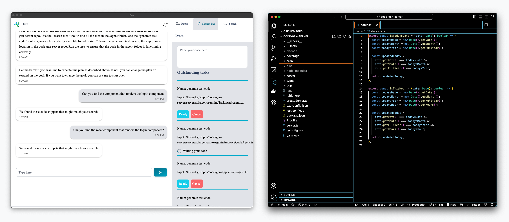

# Exo Server

[](https://www.getexo.dev/)
[](https://twitter.com/kevingrassi)

## TLDR

[Exo](https://www.getexo.dev/) is an experimental project that uses an electron app with access to the file system to support common software development tasks using LLMs.

In short, Exo is an app that can help you read, write and refactor code directly in your codebase. You can find a bunch of demos on my Twitter page above.

Exo server is the backend for the Exo electron app.

Here is the repo for the Exo [electron app](https://github.com/Exoaihq/exo-app). This is the Exo server repo. You'll need to clone both to get the app to work locally.

Screen shot of the Exo app next to vscode:

<p align="center">
    
</p>

## ⚠️⚠️⚠️ Caution ⚠️⚠️⚠️

Exo is under under construction!

I have released this into the wild far before it is production ready. Use at your own risk!

## Table of Contents

1. [Demo](#demo)
1. [Vision](#vision)
1. [How it works](#how-it-works)
1. [Quickstart](#quickstart)
1. [Deploy](#deploy)
1. [Contributions](#contributions)
1. [Usage](#usage)
1. [Limitations](#limitations)
1. [Road map](#road-map)
1. [Contact and more info](#contact-and-more-info)

## Demo

https://www.loom.com/share/5f34499ccfb54bfdae32ee50f454b365

## Vision

The goal of the Exo app is to create [Tony Stark's Jarvis/F.R.I.D.A.Y.](https://www.youtube.com/watch?v=uKndgvIu5MY) - a chat or voice interface that you can interact with to write code and build things.

How this is different from other code generation tools?
Exo is a freestanding app the lives on your desktop. We are far from it now, but in the future you could use _Exo_ to build software (as opposed to an IDE).

Being a freestanding application, Exo embraces UI tools that are more aligned with coding practices in a post-LLM world.

## How it works

1. Code indexing - Exo allows you to index and store your code in a db. Code metadata (code explanations, dependencies, etc) and the embedding vectors live right next to each other in the postgres db. This allows LLM agents to quickly get context about user queries.
2. LLM agents - Exo uses LLM agents (similar to Langchain, Autogpt and others) to do common programming tasks. It will take your query, come up with a plan and then write code that executes our plan. Check out the demo above for how this works.
3. File system wrapper - The exo election app is a wrapper for your file system. After writing code, Exo server will use the `ai_create_code` endpoint to pass the code back down the app where it will be written to your codebase.

## Quickstart

https://www.loom.com/share/d2ec3f01140746e6ae1d47507f24e5ec

### Clone repos

```
git clone https://github.com/kmgrassi/exo-server
yarn install
```

You need two accounts to get started:

1. Open AI: https://platform.openai.com/signup?launch
2. Supabase (hosts the database): https://app.supabase.com/sign-up

If you just want to start using Exo without these accounts you can sign up to use the app here: https://www.getexo.dev/auth/signup

### Add credentials

Grab your credentials after creating your account and paste into the `.env-example` file:

```
SUPABASE_ANON=Your-supabase-anon-here
SUPABASE_URL=Your-supabase-url-here
SUPABASE_DB_ID=Your-supabase-id-here
SUPABASE_DATABASE_PASSWORD=Your-supabase-password-here
OPENAI_API_KEY=Your-openai-api-key-here

```

Rename `.env-example` to `.env`

After you've added your credentials run:

```
yarn run create-db-schema
```

This will update your Supabase database with the schema found in the `schema.sql` file.

### Run

```
yarn run dev
```

## Deploy

Deployment details coming soon. I use Heroku. There is a Procfile so you should be able to easily deploy to Heroku.
TODO - add "deploy to Heroku" button

## Usage

### Chat

Exo is a chat app. You interact with the UI via the chat interface. You can ask questions like: "Can you write a ts function that counts the letters in a string to the scratch pad?"

### Indexing a repo

To index a repo:

```
Click on "Select repo"
Then "Save Repo"
Then click on the paper icon with the up arrow
```

This will send all the files in the repo to the server to be indexed. The server will use the LLM to get a code explanation, embed the code and the explanation and store everything in the db.

### Search

After you index a repo you can search for code in that repo. For example: "Find the component that renders the login component"

### Writing code

TODO - explain several ways to use the app to write code.

## Limitations

- Exo is far from production ready. It has many rough edges and poor UI/UX.
- All the writing code tasks are done with GPT4. If you don't have access to the GPT4 you are out of luck because it currently doesn't fall back to another engine. I've found that there is a huge difference between the code quality of GPT4 vs any other engine.
- The agents are not polished and often come up with the wrong plan, write the wrong code, etc
- There has been A LOT of tinkering that went into building the app so far. Many of the false starts have been left in the codebase. Sorry. Ill fix as I can.
- There are MANY poor architecture decisions. Too many to list. However, one major issue is the app constantly pings the API to get messages, etc. I have a couple ideas for using sockets. If this really bothers you - fire in a PR.

## Road map

TODO - add road map

## Contact and more info

You can find a bunch of videos describing how this was built on my [twitter feed](https://twitter.com/KevinGrassi).

Feel free to dm me on twitter or email: `kmgrassi` with the usual email client
